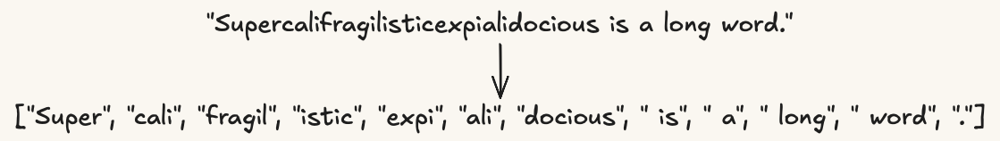
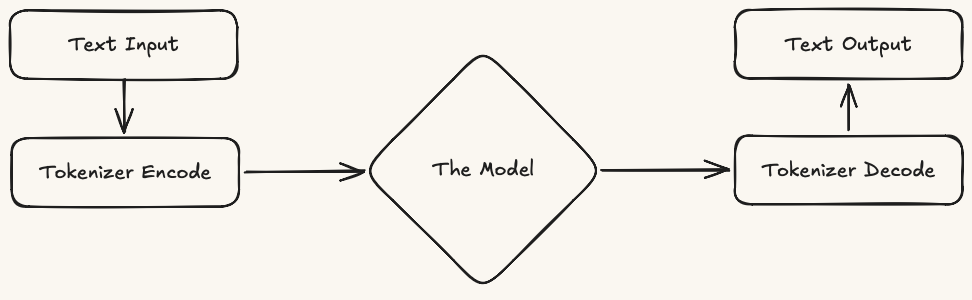
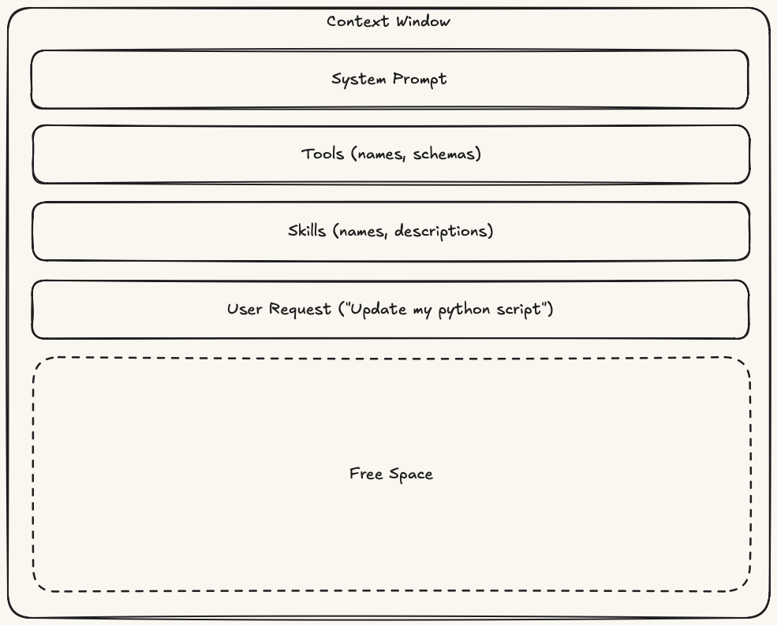
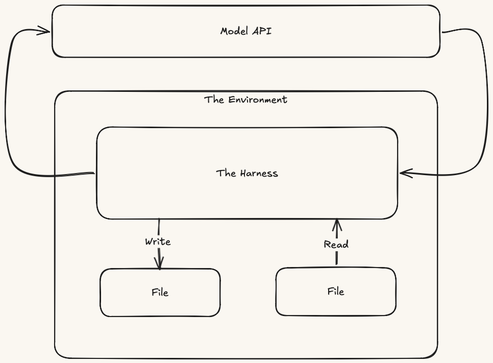
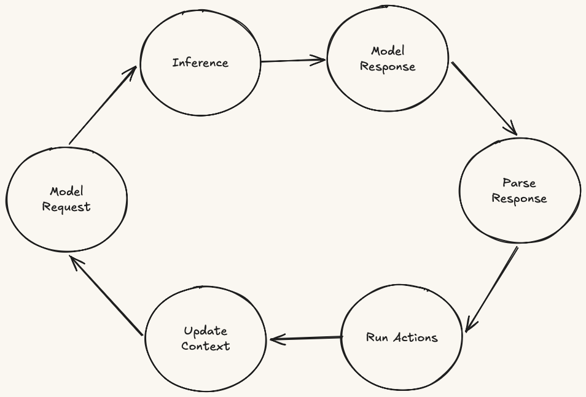

## [Preamble] What This Document Is {#what-this-is}

Anthropomorphic metaphors have their place in how we talk about agentic systems. Treating an agent like a *persona* or a subagent like a *teammate* can speed up early design conversations. Even *skill*, now an industry-standard term, quietly frames a collection of conditionally-loaded text files as something that sounds like a competency. However, for some engineers this vocabulary can prove inaccurate or, worse, inaccessible. For those engineers, myself included, it's worth setting the metaphors aside long enough to see what each component actually *does*.

This document is what you get when you strip away the metaphors and magic. It is a mechanical explanation of the components that make up modern agentic systems, from the model request boundary to the harness patterns built around it. The thesis is simple: agentic architecture is harness architecture, and harness architecture is context architecture. Once you ask what the model can see, what the harness can execute, and what happens to context between model requests, the tradeoffs stop being guesswork and become things you can reason about directly.

This document is not a tutorial, a how-to for any specific harness (Claude Code, Copilot CLI, OpenCode, etc.), or an API reference. The goal is a shared mental model that any engineer can use to evaluate, design, or critique an agentic system without getting trapped in vendor-specific metaphor.

## [I · Foundations] Tokens {#tokens}

**Definition:** A token is a chunk of text used as a unit for processing, prediction, counting, and billing. Tokens are not necessarily words; they may be whole words, parts of words, punctuation, whitespace, or other text fragments.



Before an AI system can work with text, a tokenizer breaks the text into tokens. A familiar word may stay whole, while a longer word may become several pieces. Token counts therefore matter for both limits and cost. Two sentences with the same number of words can require different amounts of processing, and providers usually charge based on how many tokens are sent in and generated back.

## [II · Foundations] The Model {#model}

**Definition:** A model is a stateless service that receives text, processes it as tokens, and returns predicted text. It does not remember previous requests, execute code, inspect your environment, or take action; it only returns text.

> **Examples:**
>
> GPT-5.5, Claude Opus 4.7, Gemini 3.1 Pro, Llama 4 Maverick, and other named model endpoints.

When we say a model *has* a tool, *uses* a skill, or *acts* as an agent, we are describing harness behavior around the model, not properties inside the model. Everything else in this document exists because the harness decides what text to send (as context), how to interpret the text that comes back, and what to do before the next model request.

## [III · Foundations] Inference {#inference}

**Definition:** An inference is one pass through a model: input text is processed as tokens, and predicted text is returned.



The important word is *one*. An inference is not a conversation, a workflow, or an action loop. One inference has no memory of another unless earlier text is sent again, and it does not perform actions; it only returns text.

**Fun fact:** LLMs are not inherently non-deterministic in the way many people assume. The model predicts a distribution over likely next tokens; non-determinism is introduced optionally afterward while selecting tokens from that distribution.  This randomness is injected to simulate creativity.

## [IV · Foundations] The Context Window {#context-window}

**Definition:** The context window is the input text for a single inference: the set of tokens the model can use while generating its response. Anything outside the context window does not exist to the model; everything inside competes for finite attention and space.



This is why agentic architecture is largely context architecture. A system prompt, a tool schema, a file attachment, a skill body, a tool result, or a subagent summary can affect the next inference only if the harness includes it in the next model request. Everything in the context window is represented to the model as text, and that text consumes tokens. The question is always when something enters context, how much space it consumes, and what role it plays in the next model request.

## [V · Foundations] The Harness {#harness}

**Definition:** The harness is the runtime or application responsible for operating the model: it constructs each model request, sends it to the model, parses text returned by the model, executes any requested actions in its own environment, and decides what populates the context window for the next model request.



> **Examples:**
>
> IBM Bob, Claude Code, GitHub Copilot CLI, Cursor, Aider, Cline, OpenHands, and custom LangChain or LangGraph applications.

Whether it is a coding assistant in your IDE, a chat interface, or a custom Python script calling an API, the harness owns the state and side effects the model lacks. The model can request execution only by returning text the harness can parse; the harness decides whether that request maps to an available capability, runs the action if allowed, and places the result in the context window for the next model request.

Every construct in this document is fundamentally a harness design choice: what gets exposed, what gets executed, what gets isolated, and what gets forbidden. To the model, every request is still atomic and independent; agent and subagent boundaries only exist because the harness builds and enforces them. If a product says a construct "cannot" do something, read that as "this harness does not expose or permit that path," not as a property of the model.

## [VI · Foundations] The Agentic Loop {#loop}

**Definition:** The agentic loop is the cycle a harness runs for every prompt: it sends a model request, receives a model response, parses that response for requested actions, runs any allowed actions, updates context, and repeats until no further actions are requested. When the loop stops, the harness shows the model's final response to the user.



The loop is what makes a harness agentic. Strip it away, and you have a standard chatbot. Add it, and you have a system capable of chaining actions together to achieve a goal.

A simple prompt such as "Rewrite this paragraph more clearly" still runs through the loop, but only once: the harness sends the request, receives the model response, finds no requested action, and shows that final response to the user. A prompt such as "Find the failing test, fix the bug, and verify the result" requires multiple passes through the loop: the model requests file reads, test runs, edits, and follow-up checks; after each action, the harness updates context and sends another model request. When no further action is requested, the harness shows the model's final response to the user.

1. **Model Request:** The harness sends a model request containing the current context.
2. **Inference:** The model processes the request text as tokens.
3. **Model Response:** The model returns predicted text.
4. **Parse Response:** The harness parses the model response for requested actions, such as a formatted JSON tool call.
5. **Run Actions:** If an allowed action was requested, the harness executes it in its own runtime environment, outside the model.
6. **Update Context:** If an action ran, the harness places the result in the context window for the next model request. If no action was requested, the loop stops and the harness shows the model response to the user.

## [VII · Context Architecture Lens] The Three Axes {#axes}

Before comparing tools, skills, agents, and subagents, it's crucial to keep each of the following questions in mind:

1. **Initialization:** When does its model-visible payload enter the context window?
2. **Agentic Loop Scope:** Which agentic loop does this construct operate within?
3. **Context Payload:** What gets added to the context window?

| Construct | Initialization | Agentic Loop Scope | Context Payload |
| --- | --- | --- | --- |
| Tool | Session initialization | Current loop | Request schema only (opaque code) |
| Skill | On skill request | Current loop | Manifest, scripts, files (transparent) |
| Agent | On session start or agent selection | Defines the current loop | System prompt, toolset, skill set, permissions |
| Subagent | When a parent agent invokes it | Defines the child loop | System prompt, toolset, skill set, permissions |

Note that this table flattens constructs onto comparable axes but does not capture composition: agents contain tools and skills, skills routinely invoke tools, including MCP-delivered tools, and subagents are themselves agents configured with their own tools and skills.

## [VIII · Agentic Construct] Tools {#tools}

**Definition:** A tool is a named operation the harness makes available to the model through a description and request schema.

> **Examples:**
>
> `read_file`, `write_file`, `execute_shell`, `read_web`, `search_code`, and `mcp-atlassian-jira_get_issue`.

- **Initialization:** A tool's name, description, and request schema are made available to the model before it can request that tool.
- **Execution:** When the model emits a tool call matching the request schema, the harness intercepts the request, runs the named tool in its own runtime environment, and appends the return value as text to the context window before issuing the next model request. The model itself never executes code; it only requests execution.
- **Visibility:** The implementation is opaque to the model. The model sees the name, description, request schema, and returned text; it never sees the underlying code.

```text
# illustrative only; actual syntax varies by harness
tool {
  name:        "search_docs"
  description: "Search product documentation when the answer depends on
                published docs or configuration details."

  schema: {      # visible to the model
    query:       string    # required
    product:     string    # optional filter, e.g. "watsonx"
    max_results: integer   # default: 5
  }

  handler: search_docs_impl()   # harness-owned; opaque to the model
}
```

## [IX · Agentic Construct] Skills {#skills}

**Definition:** A skill is a named bundle of files made available to the model through a description. When the model requests the skill, the harness reads its full contents, usually instructions plus supporting files, into the context window for the next model request.

> **Examples:**
>
> Code-review runbooks; release or deployment runbooks; incident-response playbooks; organization-specific style-guide skills; and Anthropic's shipped document-processing skills for PDF, DOCX, XLSX, and PPTX.

Where a tool exposes an operation the harness can execute, a skill exposes instructions the model can follow, often by orchestrating one or more tool calls along the way.

Skill invocation resembles tool invocation at the model boundary: the model sees a name and description, then returns text the harness parses as a request to load that skill. The difference is the harness response. A tool request executes opaque code and returns a result; a skill request reads transparent procedural content into the context window.

Two properties distinguish them from tools:

- **Lazy loading:** Only the skill's name and a brief description sit in the system prompt. The full body (manifest, instructions, supporting files) is only injected into the context window when the model explicitly decides to read or invoke it.
- **Transparent payload:** A skill is a directory containing a manifest and supporting files (scripts, templates, prose). Unlike a tool, which hides its code, a skill allows the model to open and read its bundled contents *before* invoking them (usually via a generic execution tool provided by the harness).

Skills compose with tools rather than replacing them. A skill's instructions typically direct the model to invoke specific tools (local or MCP-delivered) in a particular sequence, with branching logic the model interprets at read time. The relationship is hierarchical: skills can orchestrate tools; tools cannot contain skills.

```text
# illustrative only; actual structure varies by harness
skill {
  name:        "production-deploy"
  description: "Use before a production deployment or when a deployment fails."

  body: {        # loaded into context only after the skill is requested
    instructions: [
      "Verify CI status and release approval.",
      "Run the canary deployment.",
      "Smoke test critical endpoints.",
      "Promote to full production only if checks pass.",
      "If a check fails, follow rollback.md."
    ]
    files: [
      scripts/check_ci.sh,
      scripts/canary_deploy.sh,
      docs/rollback.md
    ]
  }
}
```

## [X · Agentic Construct] Agents {#agents}

**Definition:** An agent is a named configuration that tells the harness how to run an agentic loop. It bundles a system prompt, toolset, skill set, permissions, and possibly subagents the loop may invoke.

> **Examples:**
>
> Planner, Builder, Researcher, Code Reviewer, QA, and Security Reviewer are agent types configured with different prompts, tools, skills, and permissions.

With tools and skills defined, an agent is easier to see mechanically: it is not a peer to tools or skills in the sense of doing the same kind of work. Rather, an agent composes tools, skills, instructions, and permissions into a particular operating configuration. That configuration is defined by four things:

1. **System Prompt:** The instructions that define the agent's role, purpose, and behavior.
2. **Toolset:** The operations the agent may request from the harness, along with any access limits around them.
3. **Skill Set:** The procedural knowledge the agent may load into context when relevant.
4. **Permissions and Subagent Access:** The rules that determine what the agent may do directly and which separate loops, if any, it may ask the harness to start.

Most harnesses ship with one or more **built-in agents**, which have predefined system prompts and toolsets exposed as *modes* (e.g., Planner, Coder, Researcher). Some harnesses also support **user-defined agents**, allowing operators to register their own system prompts and curate which tools, skills, MCP connections, and subagents are available within that agent's loop.

Do not confuse an agent with files such as `AGENTS.md`, `CLAUDE.md`, or similar repository instruction files. Those files are not agents; they are context sources. If a harness loads them, their contents become instructions inside the context window for an agentic loop.

```text
# illustrative only; actual structure varies by harness
agent {
  name:          "migration-planner"
  description:   "Plan complex migrations before implementation."
  system_prompt: "You are a planning agent. Break the requested migration
                  into safe phases, identify risks, and return an
                  implementation plan before code changes."
  model:         "opus"   # optional; may inherit from the session
  tools:         [read_file, grep, search_docs]
  skills:        [architecture-review, migration-playbook]
  subagents:     [code-reviewer, test-failure-triage]
  permissions:   read_only
}
```

> **Portability Note:** The capability to bring your own agent is not universal. It is a deliberate harness feature, and its absence can be a meaningful constraint when evaluating a harness.

## [XI · Agentic Construct] Subagents {#subagents}

**Definition:** A subagent is a separate agentic loop started by the harness in response to a parent agent's request. It runs with its own context window, system prompt, and toolset; when it finishes, the harness places only its final output back into the parent's context window.

> **Examples:**
>
> Research, code-review, test-failure triage, security-review, documentation, migration-planning, and dependency-upgrade subagents spawned by a parent coding agent.

A subagent helps when the parent can hand off a clearly scoped task, such as research, review, or triage, and receive a compact result back. It can also help when the work would consume too much parent context or should run with a narrower toolset. It hurts when the task depends tightly on the parent's surrounding context, is small, or would require an expensive summary to be useful.

When the harness starts a subagent, the parent loop waits while the child loop works. The parent receives a summary or artifact, not the child's full intermediate history. This keeps the parent context cleaner, but detail can be lost at the handoff.

A parent-child workflow spends tokens in both loops: the parent frames the task and absorbs the result, while the child spends context on investigation, tool use, and summarization. The question is whether isolation, scoped permissions, or parallel exploration justify the added coordination and spend.

Some harnesses prohibit nested subagents; others could allow them. That difference is orchestration policy, not a model constraint.

```text
# illustrative only; actual structure varies by harness
subagent {
  name:          "code-reviewer"
  description:   "Invoke for pull request review or pre-commit code audit."
  system_prompt: "You are a senior reviewer. Focus on correctness,
                  security, and style. Cite line numbers and propose
                  concrete diffs when possible."
  model:         "sonnet"   # cheaper than parent's opus
  tools:         [read_file, grep, run_tests]   # narrower than parent
  skills:        [review-checklist, secure-coding-guidelines]
  subagents:     []   # optional; nesting is a harness policy, not a model constraint
  permissions:   read_only
}
```

> **Cost Note:** Anthropic's June 2025 multi-agent research system report found roughly 15× more token use than comparable single-agent baselines.

## [XII · The Harness Extended] MCP {#mcp}

**Definition:** MCP is a standardized protocol that lets a harness connect to external servers that expose tools, resources, or prompts. MCP does not give the model a new capability directly; the harness must register or inject what the server provides before it can appear in the context window or be requested by the model.

> **Examples:**
>
> GitHub MCP server, filesystem MCP server, Playwright MCP server, PostgreSQL MCP server, Atlassian/Jira MCP server, and Terraform MCP server.

MCP is not a new model capability. It is a protocol at the harness boundary: it extends the harness's perimeter by moving authentication, portability, vendor coupling, permissions, and service ownership out of the local runtime and into a relationship with another system.

Today, MCP-exposed tools are the most common use case, but the protocol is broader than tool delivery. An MCP server can expose tools, resources, and prompts; the harness can expose capabilities back to the server, such as LLM inference, workspace scope, and user input collection. Once registered or injected by the harness, these resolve into patterns this document has already described:

- An MCP tool, once registered by the harness, is a tool: schema enters context, implementation remains opaque, result returns as context.
- An MCP resource or prompt, once injected by the harness, is context: content added to the next model request, no different in kind from a local file, a system prompt fragment, or a skill body.

What MCP does not change is the harness's responsibility: deciding what to expose, what to execute, what to inject, and what reaches the model.

In practice, most harnesses fully surface MCP tools. Support for resources and prompts is uneven. Some expose them as attachable context and slash commands; others ignore them entirely. That variance is the point: the specification may define what can cross the boundary, but the harness decides what actually becomes available in the loop.

> **Key Takeaway:** MCP standardizes the boundary between a harness and external capability servers. It does not create a new model-side capability; what arrives over MCP still becomes a tool, context, or harness-mediated request before it reaches the model.

## [XIII · Synthesis] Implications {#implications}

By evaluating these constructs by their behavior rather than their metaphors, several architectural tradeoffs become clear:

- **The harness and loop are the operating frame.** Tools, skills, agents, and subagents are useful only because a harness can run an agentic loop: construct model requests, parse requested actions, execute allowed work, and place results back into context.
- **MCP is not an agentic construct.** MCP is a delivery boundary. You can have a local tool, an MCP-delivered tool, or a skill that instructs the model to use an MCP-delivered tool.
- **Skills and tools compose rather than compete.** A tool exposes an operation the harness can execute. A skill exposes procedural knowledge the model can follow, often by invoking one or more tools. The reverse does not hold: tools have no mechanism to contain or invoke skills.
- **Subagents trade isolation for coordination cost.** A subagent provides a fresh context window and scoped toolset, but introduces startup, summarization, and token overhead. It is useful when that isolation is worth more than the added cost.
- **Construct selection is an architectural decision.** Personas, runbooks, and teammates can be useful metaphors while sketching a system, but they do not define implementation boundaries. The mechanical questions are what the model can see, what the harness can execute, and what happens to context between model requests.

## [XIV · Further Reading] Recommended Reading {#further-reading}

Now that you have the baseline, these articles are useful next reads. They were influential in the writing of this taxonomy and expand the same mechanical view from different angles:

- **Anthropic, ["Building Effective Agents"](https://www.anthropic.com/engineering/building-effective-agents)** — expands on workflows versus agents and common orchestration patterns.
- **Anthropic, ["How we built our multi-agent research system"](https://www.anthropic.com/engineering/built-multi-agent-research-system)** — expands on subagents, parallel context windows, coordination cost, and token spend.
- **Chen Zhang, ["Claude Code's Leaked Source: A Real-World Masterclass in Harness Engineering"](https://dev.to/chen_zhang_bac430bc7f6b95/claude-codes-leaked-source-a-real-world-masterclass-in-harness-engineering-2d9n)** — expands on harness internals: caching, memory, security checks, cost control, rendering, and state.
- **Agentic Engineer, ["The Only Claude Code Competitor"](https://agenticengineer.com/the-only-claude-code-competitor)** — expands on harness-design tradeoffs through Claude Code versus Pi.
- **Simon Willison, ["The lethal trifecta for AI agents"](https://simonwillison.net/2025/Jun/16/the-lethal-trifecta/)** — expands on tool exposure, untrusted context, private data, and exfiltration risk.
- **Armin Ronacher, ["Agentic Coding"](https://lucumr.pocoo.org/2025/6/12/agentic-coding/)** — expands on tool ergonomics, logs, scripts, and feedback loops in real agentic coding practice.
